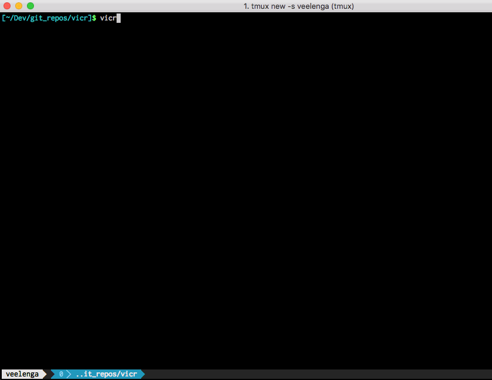

# vicr 

Vicr stands for **"Vim-like Interactive CRystal"** and represents a tiny command line application
that designed to quickly execute Crystal code with fast feedback and options to proceed:

At the moment only Vim is supported, but other editors are going to be worked soon.

## Development

VICR is in the initial stage and the following features planned to be added:

- [X] Initial console application
- Custom editors support
- Console Crystal code colorization
- Github gist support
- Ability to easily choose and run Crystal samples

## Contributing

If you feel like you have a good idea to be implemented, please open a discussion.

If you found a defect and enough movivated to fix it, pull requests are welcome.
